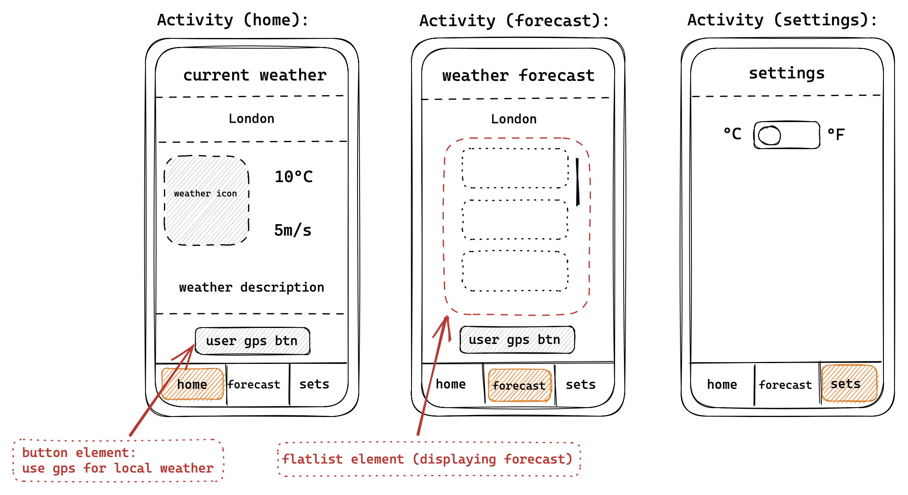

## How to run this project

``` git clone https://github.com/jenjei/weather-app-react-native ```

:arrow_down:

``` cd weatherApp```

:arrow_down:

``` npm install ```

:arrow_down:

``` npm start ```


## Quick UI design sketch



## Final result